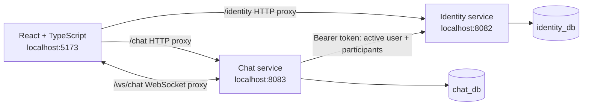

# Messenger · Microservices

**A full-stack messaging application built with Java, Spring Boot and React.**

Register, manage your profile, create direct or group conversations, and exchange messages with live updates in a responsive Greek-language interface.

This project explores the transition from a [Spring Boot monolith](https://github.com/liakosV/Messenger-app-monolith) to independently running identity and chat services. It focuses on clear service boundaries, authenticated communication, database ownership, and a frontend organized around user features.


## Features

- **Accounts:** registration, login with username/email/phone, BCrypt password hashing, RS256 JWT access tokens, profile editing and password-confirmed account deactivation.
- **Conversations:** direct and group chats with 2–100 participants, paginated lists, participant validation, leaving conversations and deletion by the creator while still a participant.
- **Messages:** paginated history, sending, editing and deleting your own messages, and live create/update/delete events over WebSocket.
- **Frontend:** responsive layout, session expiry handling, confirmation dialogs, connection status, automatic socket reconnection and reconciliation with REST responses.
- **Developer experience:** Gradle wrappers, Flyway migrations, Swagger/OpenAPI documentation and automated backend/frontend tests.

## Architecture



| Module | Responsibility | Main technologies |
| --- | --- | --- |
| `identity-service` | Users, credentials, profile lifecycle and JWT issuance | Spring MVC, Security, JPA, BCrypt, RSA |
| `chat-service` | Conversation membership, message ownership and live events | Spring MVC, Security, JPA, WebSocket |
| `frontend` | Authentication, profile and messaging interface | React 19, TypeScript, Vite, Lucide |

Each backend owns its database schema. Chat stores user UUIDs rather than user records and has no foreign keys into the identity database. It verifies JWTs with the identity service's public key and calls identity to verify active accounts. If identity is unavailable, protected chat operations fail with a service-unavailable response.

The backend follows controller → service → repository layers, with DTOs and mappers separating HTTP contracts from persistence. The frontend separates components, hooks, API modules and model helpers by feature. See the [code guide](docs/CODE_GUIDE.md) for class responsibilities and the [frontend architecture](frontend/ARCHITECTURE.md) for component and hook boundaries.

## Run locally

### 1. Prerequisites

- JDK **21** available to Gradle.
- **Node.js 22.12+** and npm.
- A running **MySQL 8** server with permission to create two databases.
- **PowerShell 7** for the Windows examples below. On macOS/Linux, use `./gradlew` and shell environment exports instead of `gradlew.bat` and `$env:`.

Docker support is planned; the current setup runs the two backends and frontend separately.

```powershell
git clone https://github.com/liakosV/messenger-microservices.git
cd messenger-microservices
```

### 2. Create empty databases

Run in your MySQL client:

```sql
CREATE DATABASE identity_db CHARACTER SET utf8mb4 COLLATE utf8mb4_unicode_ci;
CREATE DATABASE chat_db CHARACTER SET utf8mb4 COLLATE utf8mb4_unicode_ci;
```

Use a local database account with schema migration and CRUD permissions on these two databases. Flyway creates the tables on startup; Hibernate validates them. Use empty databases for a fresh setup rather than an existing monolith schema.

### 3. Generate a local RSA key pair

Run once in PowerShell 7. Keep the generated files outside this repository. Both services must use the same public key; only identity receives the private key.

```powershell
$messengerKeyDirectory = Join-Path $env:USERPROFILE '.messenger-identity-keys'
$messengerPrivateKey = Join-Path $messengerKeyDirectory 'private.pem'
$messengerPublicKey = Join-Path $messengerKeyDirectory 'public.pem'
if ((Test-Path $messengerPrivateKey) -or (Test-Path $messengerPublicKey)) {
    throw 'Keys already exist. Use your existing pair instead of overwriting it.'
}
New-Item -ItemType Directory -Path $messengerKeyDirectory -Force | Out-Null
$messengerRsa = [System.Security.Cryptography.RSA]::Create(3072)
try {
    $messengerEncoding = [System.Text.UTF8Encoding]::new($false)
    [System.IO.File]::WriteAllText($messengerPrivateKey, $messengerRsa.ExportPkcs8PrivateKeyPem(), $messengerEncoding)
    [System.IO.File]::WriteAllText($messengerPublicKey, $messengerRsa.ExportSubjectPublicKeyInfoPem(), $messengerEncoding)
} finally {
    $messengerRsa.Dispose()
}
```

Restrict access to the private key to the account running identity. Keys and local `.env` files are excluded from Git.

### 4. Start identity (terminal 1)

From the repository root, replace the database placeholders with your local values:

```powershell
$env:IDENTITY_DB_URL = 'jdbc:mysql://localhost:3306/identity_db'
$env:DB_USERNAME = '<your-local-db-user>'
$env:DB_PASSWORD = '<your-local-db-password>'
$env:IDENTITY_JWT_PRIVATE_KEY = 'file:' + (Join-Path $env:USERPROFILE '.messenger-identity-keys/private.pem').Replace('\', '/')
$env:IDENTITY_JWT_PUBLIC_KEY = 'file:' + (Join-Path $env:USERPROFILE '.messenger-identity-keys/public.pem').Replace('\', '/')
cd identity-service
.\gradlew.bat bootRun
```

### 5. Start chat (terminal 2)

In a new terminal at the repository root:

```powershell
$env:CHAT_DB_URL = 'jdbc:mysql://localhost:3306/chat_db'
$env:DB_USERNAME = '<your-local-db-user>'
$env:DB_PASSWORD = '<your-local-db-password>'
$env:CHAT_JWT_PUBLIC_KEY = 'file:' + (Join-Path $env:USERPROFILE '.messenger-identity-keys/public.pem').Replace('\', '/')
cd chat-service
.\gradlew.bat bootRun
```

Environment variables belong to the terminal that starts each service. Spring Boot does not automatically load a root `.env` file. IDE users should put the same variables in each run configuration.

| Optional variable | Default | Purpose |
| --- | --- | --- |
| `IDENTITY_JWT_ISSUER` | `http://localhost:8082` | Must match in both services |
| `IDENTITY_JWT_ACCESS_TOKEN_TTL` | `PT15M` | Identity access-token lifetime |
| `IDENTITY_BASE_URL` | `http://localhost:8082` | Chat's identity HTTP destination |
| `CHAT_ALLOWED_ORIGINS` | `http://localhost:5173,http://localhost:3000` | Allowed WebSocket browser origins |

### 6. Start frontend (terminal 3)

```powershell
cd frontend
npm.cmd ci
npm.cmd run dev
```

Open **[localhost:5173](http://localhost:5173)** using `localhost`, rather than `127.0.0.1`, so the WebSocket origin matches. Vite proxies REST and WebSocket traffic to the backend ports. For different backend addresses, copy `frontend/.env.example` to `frontend/.env.local` and change the two proxy targets.

### Try a conversation

1. Register and log in with two accounts in separate browser sessions.
2. Copy each user's UUID from their profile.
3. Create a conversation using the other user's UUID.
4. Send a message, then edit or delete it and observe the live update in the other session.

Other users are displayed with shortened UUIDs: there is currently no public user directory or profile lookup API.

## API documentation

| Service | Swagger UI | Detailed guide |
| --- | --- | --- |
| Identity | [localhost:8082/swagger-ui/index.html](http://localhost:8082/swagger-ui/index.html) | [Authentication and profiles](identity-service/AUTHENTICATION.md) |
| Chat | [localhost:8083/swagger-ui/index.html](http://localhost:8083/swagger-ui/index.html) | [Conversations, messages and WebSocket](chat-service/README.md) |

Register through the frontend or `POST /api/auth/register`, then log in through `POST /api/auth/login`. Paste the returned access token into Swagger's **Authorize** dialog without the `Bearer` prefix. Registration itself does not issue a token.

## Tests and builds

From `identity-service`, these isolated tests do not require MySQL or external keys:

```powershell
.\gradlew.bat test --tests '*UserServiceTest' --tests '*AuthServiceTest' --tests '*JwtServiceTest' --tests '*AuthControllerTest' --tests '*UserControllerTest'
```

From `chat-service`:

```powershell
.\gradlew.bat test --tests '*ChatServiceTest' --tests '*ChatControllerTest' --tests '*ActiveUserVerifierTest' --tests '*RepositoryMetadataTest' --tests '*ChatWebSocketTest'
```

The separate `*ApplicationTests.contextLoads` tests require configured databases and RSA resources. With those configured, run `.\gradlew.bat test` in each backend. Build executable jars with `.\gradlew.bat bootJar`.

From `frontend`:

```powershell
npm.cmd test
npm.cmd run test:proxy
npm.cmd run build
```

Backend tests cover service rules, HTTP authorization, JWT validation, identity verification and WebSocket behavior. Frontend tests exercise account/chat flows, API contracts and socket lifecycle; proxy tests use local HTTP/WebSocket fixtures. `npm.cmd run build` checks TypeScript and creates `frontend/dist`.

## Current scope and next steps

- Access tokens expire after 15 minutes by default; there is no refresh-token flow.
- Unread counters are session-local indicators, not persistent read receipts.
- Message events are live; conversation changes are refreshed by polling, manual refresh or returning to the tab.
- No attachments, public user search, roles/admin panel, JWKS discovery or service discovery are implemented.
- **Next:** Dockerfiles and Docker Compose for repeatable local startup.

For a hosted deployment, serve the frontend build behind an HTTPS reverse proxy with REST routing and WebSocket upgrades, configure the actual allowed origin, and supply database credentials and RSA keys externally. Vite preview is intended for local build verification.
